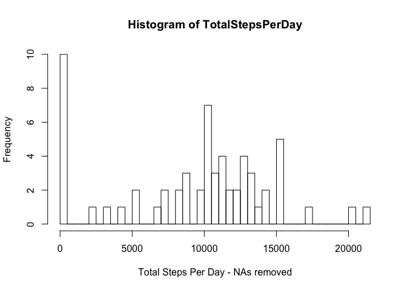
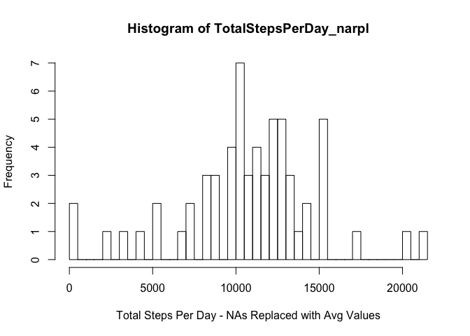

# Reproducible Research: Peer Assessment 1

------------------------------------

## Loading and preprocessing the data

```r
strUrl <-"https://d396qusza40orc.cloudfront.net/repdata%2Fdata%2Factivity.zip"
strFile <-"activity.zip"

if (!file.exists(strFile))
{
     download.file(url = strUrl, destfile = "activity.zip", method = "curl", mode = "wb")  
}
lstOfFiles <-unzip(zipfile = strFile)


df <-read.csv(file = lstOfFiles[1], colClasses = c("integer","character","integer"))
str(df)
```

```
## 'data.frame':	17568 obs. of  3 variables:
##  $ steps   : int  NA NA NA NA NA NA NA NA NA NA ...
##  $ date    : chr  "2012-10-01" "2012-10-01" "2012-10-01" "2012-10-01" ...
##  $ interval: int  0 5 10 15 20 25 30 35 40 45 ...
```

```r
df$interval.ori <-df$interval
df$interval <-sprintf(fmt = "%04d", df$interval)

df$date.ori <-df$date
df$date <-as.Date(df$date)

df$dayofweek <-weekdays(df$date)

df$daytype <-"weekday"
df[substr(df$dayofweek,1,1) == "S", "daytype"] <-"weekend"
df$daytype <-factor(df$daytype, levels = c("weekday","weekend"))
str(df)
```

```
## 'data.frame':	17568 obs. of  7 variables:
##  $ steps       : int  NA NA NA NA NA NA NA NA NA NA ...
##  $ date        : Date, format: "2012-10-01" "2012-10-01" ...
##  $ interval    : chr  "0000" "0005" "0010" "0015" ...
##  $ interval.ori: int  0 5 10 15 20 25 30 35 40 45 ...
##  $ date.ori    : chr  "2012-10-01" "2012-10-01" "2012-10-01" "2012-10-01" ...
##  $ dayofweek   : chr  "Monday" "Monday" "Monday" "Monday" ...
##  $ daytype     : Factor w/ 2 levels "weekday","weekend": 1 1 1 1 1 1 1 1 1 1 ...
```

* #### The data was loaded using `read.csv`.
* #### Existing variables were copied and then transformed: `interval.ori` & `date.ori`.
* #### New variables were created: `dayofweek` & `daytype`.

----------------------------------------------------

## What is the mean total number of steps taken per day?

```r
# 1. Calculate the total number of steps taken per day
TotalStepsPerDay <-tapply(X = df$steps, INDEX = df$date, FUN = sum, na.rm = TRUE)
head(TotalStepsPerDay, n = 25)
```

```
## 2012-10-01 2012-10-02 2012-10-03 2012-10-04 2012-10-05 2012-10-06 
##          0        126      11352      12116      13294      15420 
## 2012-10-07 2012-10-08 2012-10-09 2012-10-10 2012-10-11 2012-10-12 
##      11015          0      12811       9900      10304      17382 
## 2012-10-13 2012-10-14 2012-10-15 2012-10-16 2012-10-17 2012-10-18 
##      12426      15098      10139      15084      13452      10056 
## 2012-10-19 2012-10-20 2012-10-21 2012-10-22 2012-10-23 2012-10-24 
##      11829      10395       8821      13460       8918       8355 
## 2012-10-25 
##       2492
```


```r
# 2. Make a histogram of the total number of steps taken each day.
hist(x = TotalStepsPerDay, breaks = 60, xlab = "Total Steps Per Day - NAs removed")
```

 

```r
# 3. Calculate and report the mean and the median of the total number of steps taken per day.
(meanTotalStepsPerDay <-mean(TotalStepsPerDay))
```

```
## [1] 9354.23
```

```r
(medianTotalStepsPerDay <-median(TotalStepsPerDay))
```

```
## [1] 10395
```
* #### The mean number of steps taken each day is 9354.
* #### The median number of steps taken each day is 10395.

----------------------------------------------

## What is the average daily activity pattern?

```r
# create an array of the average steps per each 5 minute interval
AvgStepsPerInterval <-tapply(X = df$steps, INDEX = df$interval, FUN = mean, na.rm = TRUE)
head(AvgStepsPerInterval, n = 25)
```

```
##      0000      0005      0010      0015      0020      0025      0030 
## 1.7169811 0.3396226 0.1320755 0.1509434 0.0754717 2.0943396 0.5283019 
##      0035      0040      0045      0050      0055      0100      0105 
## 0.8679245 0.0000000 1.4716981 0.3018868 0.1320755 0.3207547 0.6792453 
##      0110      0115      0120      0125      0130      0135      0140 
## 0.1509434 0.3396226 0.0000000 1.1132075 1.8301887 0.1698113 0.1698113 
##      0145      0150      0155      0200 
## 0.3773585 0.2641509 0.0000000 0.0000000
```

* #### Make a time series plot of the average daily activity pattern per interval.


```r
# 1. Make a time series plot (i.e. type = "l") of the 5-minute interval (x-axis) and the average number of steps taken, averaged across all days (y-axis)
plot(names(AvgStepsPerInterval), AvgStepsPerInterval,type = "l", xlab = "5 Minute Intervals")
```

 

```r
# 2. Which 5-minute interval, on average across all the days in the dataset, contains the maximum number of steps?
(maxAvgStepsPerInterval <-AvgStepsPerInterval[AvgStepsPerInterval == max(AvgStepsPerInterval)])
```

```
##     0835 
## 206.1698
```

* #### The 5-minute interval that, on average, contains the maximum number of steps (206) is interval 0835.

--------------------------

## Imputing Missing Values.

```r
# 1. Calculate and report the total number of missing values in the dataset (i.e. the total number of rows with NAs)
(missingcases <-sum(!complete.cases(df)))
```

```
## [1] 2304
```

```r
(missingsteps <-sum(is.na(df$steps)))
```

```
## [1] 2304
```

```r
# 2. Devise a strategy for filling in all of the missing values in the dataset.
# create a matrix of avg steps per interval (row name) by day of week (column name)
mxAvgStepsPerIntervalByDow <-tapply(X = df$steps, INDEX = list(df$interval,df$dayofweek), mean, na.rm = TRUE)

# order the days of the week : Mon - Sun
mxAvgStepsPerIntervalByDow <-mxAvgStepsPerIntervalByDow[,c("Monday","Tuesday","Wednesday","Thursday","Friday","Saturday","Sunday")]

# 3. Create a new dataset (df_narpl) that is equal to the original dataset (df) where the missing data (NAs) will be filled in by avg values.
df_narpl <-df

# make copy of original steps variable
df_narpl$steps.ori <-df_narpl$steps

# loop through the new data frame "df_narpl" and replace NA steps with avg steps from the replacement matrix (mxAvgStepsPerIntervalByDow).
for (i in 1:nrow(df_narpl))
{
     isteps <-df_narpl[i,"steps"]
     iinterval <-df_narpl[i,"interval"]
     idayofweek <-df_narpl[i,"dayofweek"]
     # if steps is missing, replace with avg from dfcmatrix
     if(is.na(isteps))
     {
          df_narpl[i,"steps"] <-mxAvgStepsPerIntervalByDow[iinterval,idayofweek]
     }
}

# create an array of the Total Steps per Day from the dataset with NAs replaced by avg values.
TotalStepsPerDay_narpl <-tapply(X = df_narpl$steps, INDEX = df_narpl$date, FUN = sum, na.rm = TRUE)
```

* #### The total number of missing values in the dataset is 2304.
* #### A new data frame `df_narpl` was created from the original data frame `df`. Missing steps (NAs) were replaced with the average steps of the matching interval and day of the week in this new data frame `df_narpl`. Parts of the matrix `mxAvgStepsPerIntervalByDow` used to replace the missing values are shown below:


```r
head(mxAvgStepsPerIntervalByDow)
```

```
##        Monday   Tuesday Wednesday Thursday Friday Saturday   Sunday
## 0000 1.428571 0.0000000     4.250    5.875      0        0 0.000000
## 0005 0.000000 0.0000000     2.250    0.000      0        0 0.000000
## 0010 0.000000 0.0000000     0.875    0.000      0        0 0.000000
## 0015 0.000000 0.0000000     0.000    1.000      0        0 0.000000
## 0020 0.000000 0.4444444     0.000    0.000      0        0 0.000000
## 0025 5.000000 1.4444444     0.000    1.375      0        0 7.428571
```

```r
head(mxAvgStepsPerIntervalByDow[97:117,],12)
```

```
##         Monday   Tuesday Wednesday Thursday    Friday  Saturday    Sunday
## 0800  24.57143  55.55556   227.125   43.250  63.85714  23.42857  63.28571
## 0805  42.00000  89.11111   134.375   49.250  37.71429  31.42857  80.85714
## 0810  55.42857 149.00000   116.875  234.875 165.85714  51.28571 113.85714
## 0815  14.71429 176.77778   215.500  283.000 223.14286  38.71429 119.14286
## 0820 101.28571 170.33333   262.000  232.500 257.28571  28.57143 124.57143
## 0825  29.71429 140.66667   266.000  237.625 261.00000  61.28571  68.14286
## 0830 114.42857 163.22222   276.500  185.875 273.85714  92.42857 123.42857
## 0835 225.85714 154.88889   273.000  252.125 279.14286 155.57143 101.14286
## 0840 172.14286 177.55556   265.000  264.500 233.71429 143.71429 100.42857
## 0845 155.57143 156.33333   151.375  241.250 234.28571 215.71429 104.28571
## 0850 212.14286 116.22222   108.500  225.750 328.57143 209.57143 106.85714
## 0855 197.00000 199.66667   172.250  133.250 192.42857 220.28571  49.00000
```

```r
tail(mxAvgStepsPerIntervalByDow)
```

```
##      Monday   Tuesday Wednesday Thursday   Friday Saturday    Sunday
## 2330      0 10.444444     3.375    0.000 0.000000        0  2.428571
## 2335      0  5.111111     3.375    0.000 0.000000        0 25.142857
## 2340      0  7.111111     0.000    2.125 0.000000        0 13.428571
## 2345      0  0.000000     1.000    0.000 0.000000        0  3.714286
## 2350      0  0.000000     1.000    0.500 0.000000        0  0.000000
## 2355      0  2.222222     3.625    0.000 1.142857        0  0.000000
```


```r
# 4. Make a histogram of the total number of steps taken each day and calculate the mean and median total number of steps taken per day.
hist(x = TotalStepsPerDay_narpl, breaks = 60, xlab = "Total Steps Per Day - NAs Replaced with Avg Values")
```

 

```r
# calculate the mean and median from the dataset where NAs (missing data) were replaced
(meanTotalStepsPerDay_narpl <-mean(TotalStepsPerDay_narpl))
```

```
## [1] 10821.21
```

```r
(medianTotalStepsPerDay_narpl <-median(TotalStepsPerDay_narpl))
```

```
## [1] 11015
```

```r
# compare with the mean where NAs were removed
(meanDiff <-meanTotalStepsPerDay_narpl - meanTotalStepsPerDay)
```

```
## [1] 1466.98
```

```r
# compare with the median where NAs were removed
(medianDiff <-medianTotalStepsPerDay_narpl - medianTotalStepsPerDay)
```

```
## [1] 620
```

* #### The impact of imputing the missing data (replacing NAs with appropriate average values instead of removing records with NAs) changed the histogram of the Total Number of Steps per Day.
* #### The mean of the Total Number of Steps per Day increased to 10821 from 9354 , a difference of 1467 steps.
* #### The median of the Total Number of Steps per Day increased to 11015 from 10395 , a difference of 620 steps.

----------------------------------------------------------------------------

## Are there differences in activity patterns between weekdays and weekends?

```r
# re-create the day of the week variable
df_narpl$dayofweek <-weekdays(df_narpl$date)

# 1. Re-Create a factor variable (daytype) in the dataset with two levels - "weekday" and "weekend" indicating whether a given date is a weekday or a weekend day.
df_narpl$daytype <-"weekday"
df_narpl[substr(df_narpl$dayofweek,1,1) == "S", "daytype"] <-"weekend"
df_narpl$daytype <-factor(df_narpl$daytype)

# 2. Make a panel plot containing time series plots (i.e. type = "l") of the 5-minute interval (x-axis) and the average number of steps taken, averaged across all weekdays or weekend days (y-axis)

# create a matrix of average number of steps taken per interval per daytype (weekday & weekend)
mxAvgStepsPerIntervalByDayType <-tapply(X = df_narpl$steps, INDEX = list(df_narpl$interval, df_narpl$daytype), FUN = mean, na.rm = TRUE)
str(mxAvgStepsPerIntervalByDayType)
```

```
##  num [1:288, 1:2] 2.3107 0.45 0.175 0.2 0.0889 ...
##  - attr(*, "dimnames")=List of 2
##   ..$ : chr [1:288] "0000" "0005" "0010" "0015" ...
##   ..$ : chr [1:2] "weekday" "weekend"
```

```r
# reshape (melt) the matrix to a data frame with 3 columns : interval, day type and avg steps per interval
require(reshape2)
```

```
## Loading required package: reshape2
```

```r
df_mlt <-melt(data = mxAvgStepsPerIntervalByDayType, measure.vars = c("weekday","weekend"), id.vars = c("interval"))

# update variable names
names(df_mlt) <-c("timeInterval","dayType","avgSteps")
str(df_mlt)
```

```
## 'data.frame':	576 obs. of  3 variables:
##  $ timeInterval: int  0 5 10 15 20 25 30 35 40 45 ...
##  $ dayType     : Factor w/ 2 levels "weekday","weekend": 1 1 1 1 1 1 1 1 1 1 ...
##  $ avgSteps    : num  2.3107 0.45 0.175 0.2 0.0889 ...
```


```r
# create panel plots of avg steps by interal for each day type (weekday & weekend)
require("lattice")
```

```
## Loading required package: lattice
```

```r
xyplot(avgSteps ~ timeInterval | dayType, data = df_mlt, type = "l", layout = c(1,2), xlab = "Intervals", ylab = "Avg Steps" )
```

 

* #### The panel plots show a different pattern of Interval Activity for weekdays vs weekends --- one prominent difference is the increased activity between 10am and 6pm on weekends compared to the same period on weekdays.

-----------------------------------------------
